# Share

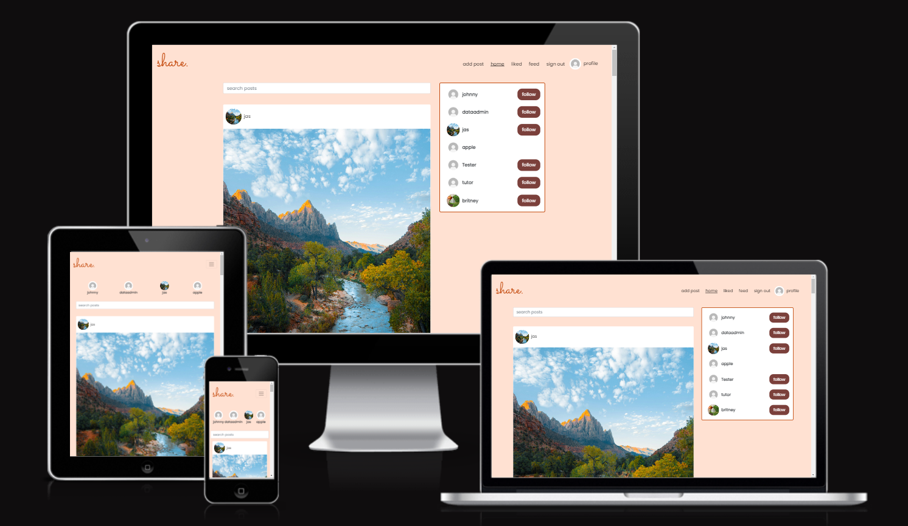

Share is a social media app where users can share images, thoughts and easily interact with other users. Users can register for an account which gives them access to the full functionality of the app. With a Share account a user can:
* Create,edit and delete posts 
* Like / unlike posts
* Create, edit and delete comments on posts 
* Like / unlike comments 
* Create, edit and delete replies to comments  
* See other users replies 
* Like other users replies
* Follow / unfollow users 
* Have their own profile and image where users can find out a bit more about them.

take a look at [Share](https://react-social-media-app-3baabd8c3ebb.herokuapp.com/)!

take a look at the [api](https://pp5-api-backend-822273010b59.herokuapp.com/)!

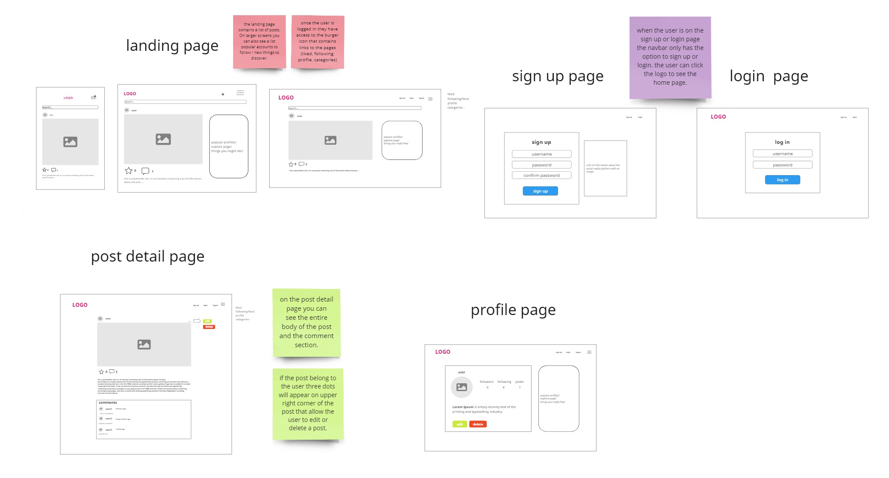
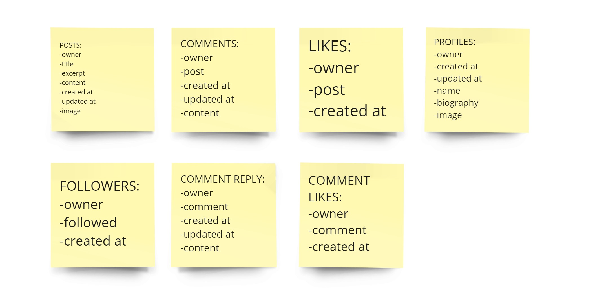

These are images of the initial wireframes for  my project. I created the wireframes using a platform called [Miro](https://miro.com/). The yellow post-it notes contain the app model structure for the api which was created using the django rest framework.

## Features:

#### Sign up page:
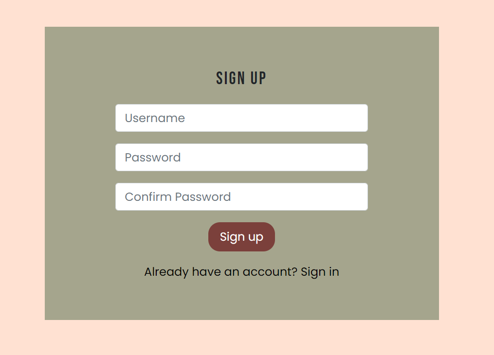
* It allows the user to sign up for an account  on Share.
* The user will be asked to provide their username, password and to confirm their password. 
* The registration form gives the user the chance to join share and  have full access to the app.

#### Sign in page 
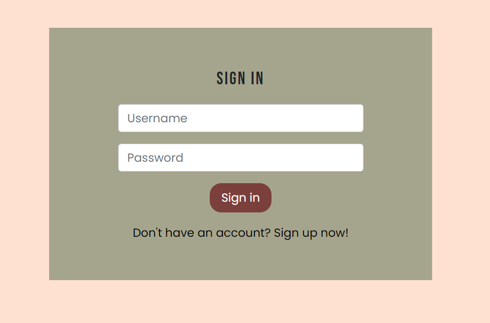
* It allows the user to login to Share  and access their profile.
* Once the user has logged in, the user has access to all the navbar links.

#### Navigation
* The navigation bar is situated at the top of each page and contains the website logo which links to the home page.
* If the user is logged in the navigation bar contains links to the add post, home, liked, feed, sign out and user profile.
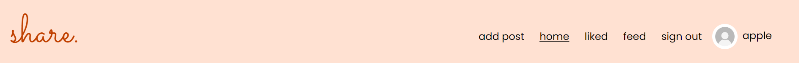
* If the user is not logged in the navbar contains links to home, sign in and sign up.
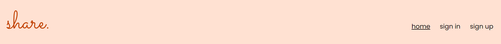
* The navigation bar gives the user easy access to each part of the website, on all devices.

#### Home page
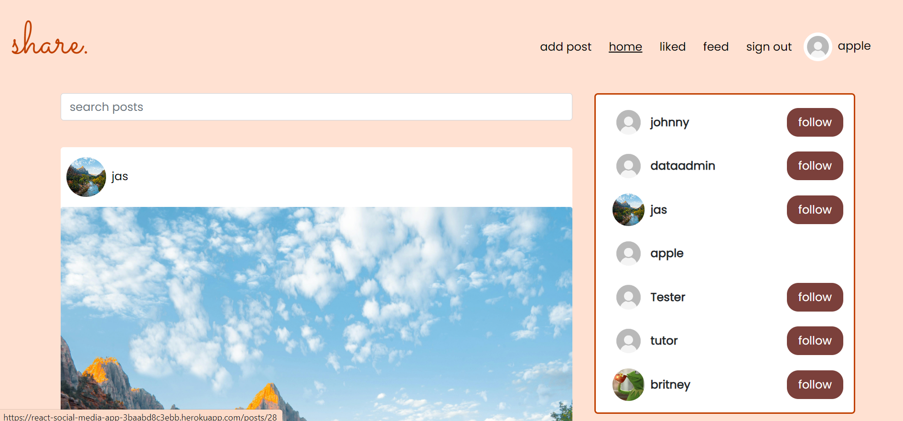
* The home page can be accessed via the app logo or the home link in the navbar.
* The home page contains a list of all the posts underneath the search bar.
* Each post contains: the post author's profile image and name which links to their profile, a post image  or  default placeholder image, a like and a comment button,  the  post title , the post content , and the post date.

#### Popular profiles section 
* The popular profiles section appears on the home page, the post page and the profile page on the desktop view.
* The section contains profiles to follow and unfollow via the follow/unfollow buttons 
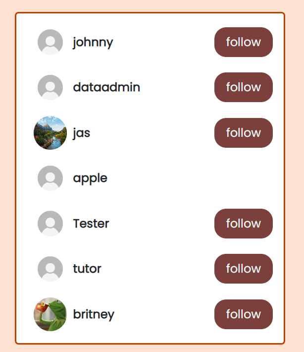
* On mobile the popular profiles section only appears at the top of the home page. 
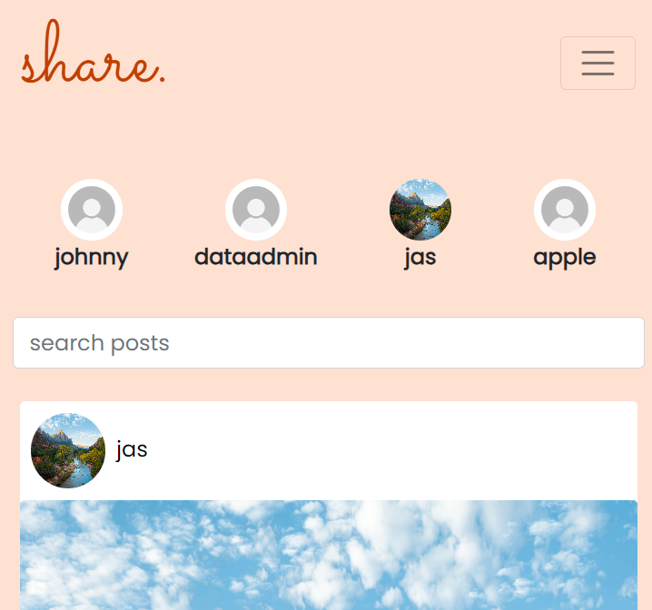

#### Post page
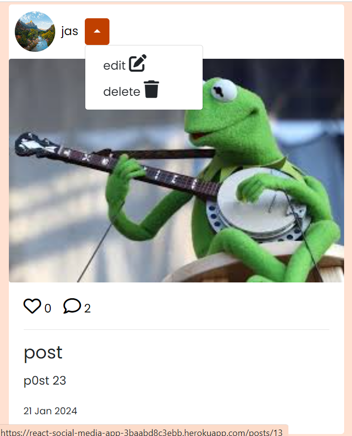
* The post page can be accessed by clicking on the post image or the comment button underneath the post image. 
* If the user is also the author of the post there will be an orange icon next to the username that opens a dropdown menu which allows the user to edit or delete the post.
* Via the like button the user can like and unlike the post, consequently the like count will go up and down by one.
* In the post page the user will have access to the comment section.

#### Comment section
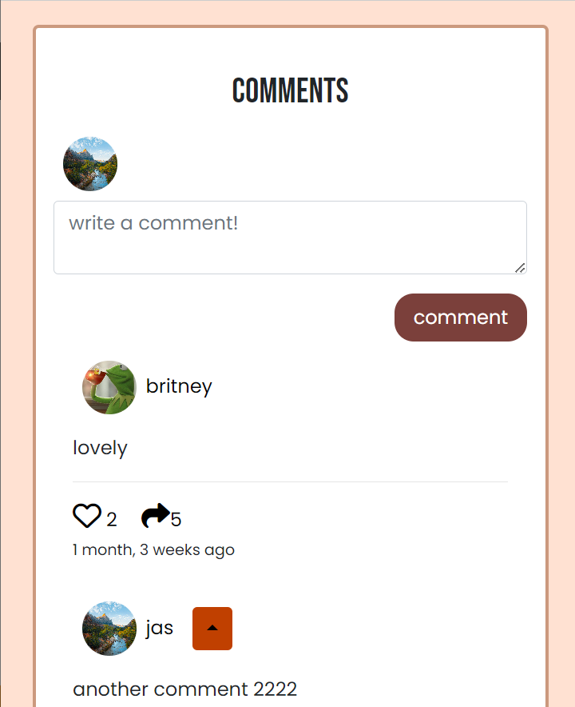
* If the user is not logged in, there’ll be a message letting them know to login in order to create a comment.
* If the user is logged in and there are no comments there will be a message suggesting that the user leave one via a form. If there are any comments they will appear under the form. 
Each comment is composed of: comment author’s profile picture and username, the comment, the like * and reply buttons and the date. 
* The comment owner can edit  or delete the comment via a drop down menu. 
* Via the like button the user can like and unlike comments consequently the like count will go up and down by one.
* Once the reply button is clicked the comment reply form appears and all the previous replies to the comment appear if there are any.Via the reply form the user can create a reply. 
* The reply owner can edit and delete the reply via a drop down menu.  

#### Profile page
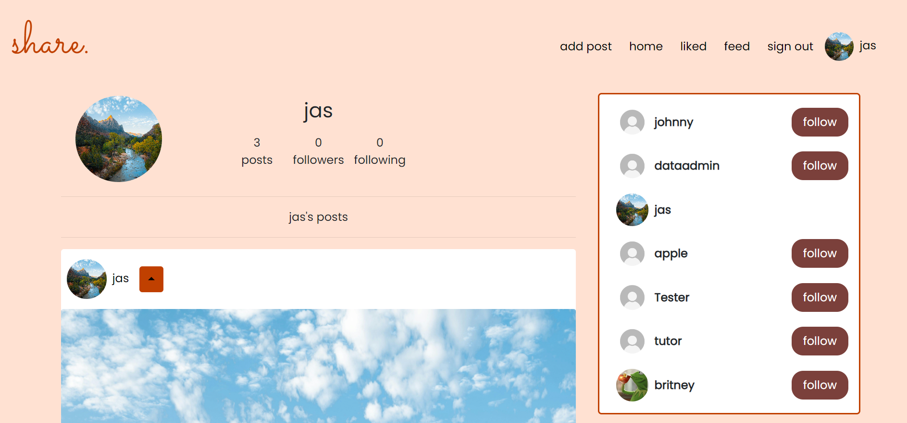
* The user’s profile page is reached via the link in the navbar. All other profiles can be reached by clicking any of the profile pictures around the app.  
* The profile page contains a section about the user:  enlarged profile picture, the number of posts a user has made, the number of followers the user has and the number of profiles the user follows. On the same page there’s a list of posts made by the user. 
* The profile owner can edit their profile picture, username and password via a drop down menu. 
* The edit form fields are  pre populated  and there are buttons to  cancel  or save changes. 

#### Add post page 
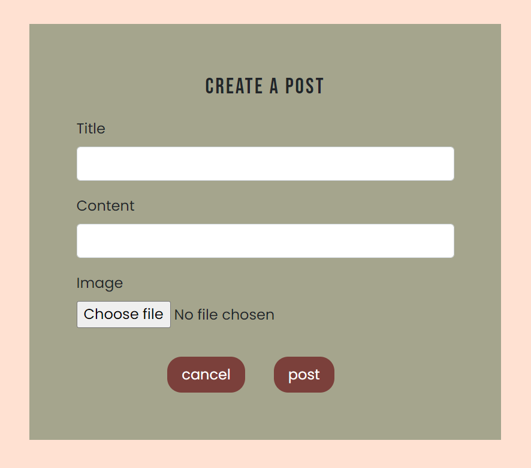
* It allows the user to create a post. Each post can contain a title, image and content. If an image isn’t provided there’ll be a default.

| action | expected behaviour | pass/fail |
|--------|--------------------|-----------|
| Enter URL in browser |the landing page of the website should display on the screen | pass |
| Click Sign up in the navigation bar | You should be redirected to the sign up form | pass |
| Click the sign up button in the sign up form  | the user should be redirected to the sign in form | pass |
| Click Sign in in the navigation bar | You should be redirected to the sign in form | pass |
| Click the sign in button in the sign in form  | the user should be redirected to the sign in form | pass |
| Click Home on the navigation bar | the home page should show up on the screen | pass |
| Click the logo on the navigation bar | the home page should show up on the screen | pass |
| Click add post on the navigation bar | The user should be redirected to the add post form | pass |
| Click liked on the navigation bar | All the posts that have been liked by a user should appear | pass |
| Click feed on the navbar | all the posts by users the user follows should appear | pass |
| Click the profile on the navbar | the user should be redirected to their profile page | pass |
| Click sign out on the navigation bar | The user is now logged out, redirected to the home page where they should only see “sign in”, “sign up”, and “home” in the navigation bar | pass |
| Click the orange dropdown in the user’s profile page | Three options should appear: edit profile, edit username and change password | pass |
| Click the ‘follow’/’unfollow’ button | The follow button will become an unfollow button and vice versa. | pass |
| Click the “like” button under a post, comment or reply | The like count should go up. If the button gets clicked again the count should go down. | pass |
| Click the comment button | you should be redirected to post page where the comment section can be found | pass 
| Click the dropdown menu next to the username on the post, comment or reply if the user is the author | Two options should appar: “edit”, “delete” | pass |
| Click the “edit” link | The user should be redirected to a form to edit the post, comment or reply | pass |
| Click the save button |  the post, common or reply should appear edited | pass |
| Click the cancel button | the user should be taken back to the post, comment or reply without making any changes | pass |
| Click the “delete link”  | the post, comment or reply should be removed from the app
 | pass |
| Click the reply icon underneath a comment  | the reply form should appear and if there are any previous replies they’ll appear too | pass |
| Click the hide button | the reply form should disappear and if there are any previous replies they should disappear too | pass |

## React Components
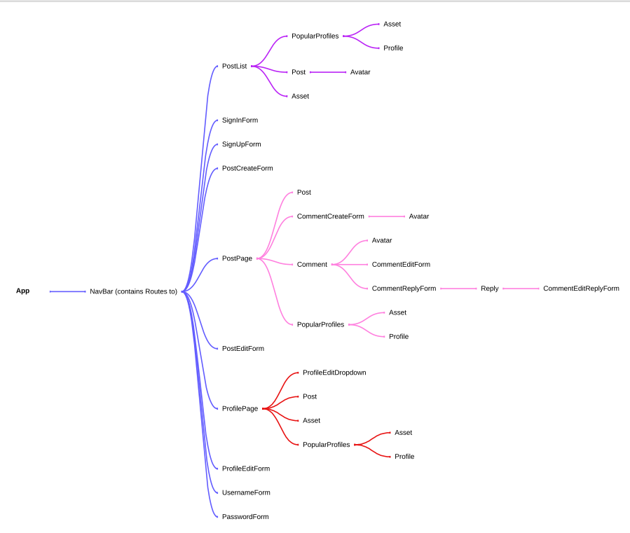
This is the component structure that was used to create the frontend. 
App.js is the default  main component and is also the parent component of NavBar which contains Routes to various other components such as:
PostList (allows the user to create a flow of posts in the home, liked and feed pages)
SignInForm (allows the user to sign in to the app)
SignUpForm (allows the user to sign up to the app)
PostcreateForm (allows the user to create posts)
PostPage (allows the user to see a post in more detail)
PostEditForm (allows the user to edit one of their posts)
ProfilePage (allows the user to view their own profile and other’s profiles)
ProfileEditForm (allows the user to edit their profile)
UsernameForm (allows the user to change their username)
PasswordForm (allows the user to change their password)
PopularProfiles(allows the user to view profiles and follow them)
Post(creates the structure of the post)
Avatar(contains the profile picture and is a link to the user’s profile)
Asset(is used as a loading spinner and can output a message)
Profile(creates the structure of the profile)
Comment(creates the structure of the comment)

## Deployment(back end)
steps:
* I made sure the libraries used were stored in the requirements.txt file.
* I clicked on "create an app" in heroku, I named the app and selected my region.
* I went to settings and added the config vars I needed.
* I then went to deploy, connected to github.
*  I then manually deploy my project.

